# Dropbox

Team Members: Allen Wang & Bisheshank Aryal

## 1. System Overview

The goal of the Dropbox client implementation is to provide a secure file storage and sharing system using cryptographic protocols to ensure confidentiality, integrity and secure sharing between users. 

### 1.1 Architecture

The system uses two servers:
*DataServer (untrusted):* Stores encrypted user data, file contents, and metadata
*KeyServer (trusted):* Stores public key for users
The client basically implements a stateless design where all the necessary information to get their user records and files is derived from their username and password, with no reliance on client side persistent storage.

### 1.2 Key Management
Each user in our system has a carefully designed key hierarchy that enables secure file storage and sharing while maintaining a stateless client design:

*Master Key:* The foundation of our key hierarchy, derived from the user's password and username (as salt) using `PasswordKDF`. This deterministic derivation enables stateless operation since the same password always yields the same master key.

*Key Encryption Key (KEK):* Derived from the Master Key using `HashKDF` with purpose "key_encryption_key". The KEK is used specifically to encrypt and decrypt other cryptographic keys, creating a separation of concerns that limits the damage if any single key is compromised.

*Metadata Encryption Key (MEK):* Derived from the Master Key using `HashKDF` with purpose "metadata_key", used exclusively to encrypt and decrypt file metadata. This separation from the KEK ensures that a compromise of file content encryption doesn't automatically compromise metadata.

*HMAC Key:* Derived from the Master Key using `HashKDF` with purpose "hmac_key", used for data integrity verification across all stored data structures.

*Asymmetric Key Pairs:*
- Public Encryption Key: Stored openly on KeyServer, allowing other users to securely send encrypted data to this user
- Private Secret Key: Encrypted with KEK and stored on the DataServer, protecting it at rest
- Public Verification Key: Stored on KeyServer, enabling others to verify signatures created by this user
- Private Signing Key: Encrypted with KEK and stored on DataServer, used by the owner to sign their content

This hierarchical key management architecture ensures that all keys can be regenerated deterministically from just a username and password, maintaining statelessness while providing strong cryptographic separation between different security domains.

### 1.3 User Record Structure

The user records are stored on the DataServer at a location deterministically derived from the username hash. This allows the system to locate user data without maintaining client-side state. The record structure follows a nested pattern to provide both confidentiality and integrity:


```
UserRecord = {
	“Inner”: Encrypted inner record
	“Hmac”: HMAC from the encrypted inner record
}

InnerRecord = {
	“Secret key”: Encrypted secret key for decryption
	“Signing key”: Encrypted signing key for verification
	“File map”: Current unused
	“Version”: Sequential version number
}
```
The outer record structure provides integrity protection through HMACs generated with the user's HMAC key. This prevents tampering with the encrypted data itself. The inner record contains the critical private keys that enable all cryptographic operations and is encrypted using the MEK. This two-layer approach ensures that even if an attacker gains the ability to modify data on the DataServer, they cannot tamper with a user's record without detection.

The deterministic derivation of the user record location (using `Hash(username.encode())[:16]`) means any authenticated client instance can locate and access the user's data without prior knowledge, enabling true stateless operation.

### 1.4 File Storage Structure

A file has two components: metadata and data. The file metadata is unique to the user and contains file information, location of the actual data, and encrypted file keys. For shared files, this metadata is slightly different with additional data. The file data is the actual encrypted file contents.

```
FileMetadata = {
"owner": Username of the file owner,
"filename": User-friendly name of the document,
"data_loc": Deterministic or random location of the actual file bytes,
"file_key": File encryption key (encrypted with the owner's KEK),
"shared_with": List of usernames the file is shared with,
"version": Sequential version number for update tracking,
"signature": Cryptographic signature of metadata by the owner,
"is_shared_copy": Boolean flag indicating if this is a recipient's view,
"created_at": Timestamp of initial creation,
"modified_at": Timestamp of last modification
}
SharedMetadata = {
    ...
    "shared_with": [] # Fixed empty list
}
FileData = {
“hash_to_loc”: Map of chunk hashes to corresponding locations of chunks,
“chunk_hashes”: Ordered array of chunk hashes,
"HMAC": Integrity Check
}
```

Each user maintains separate metadata entries even for shared files, enabling fine-grained access control and preventing metadata leakage between users. The owner's signature on metadata establishes authenticity and prevents forgery of file properties. By storing actual file data at separate locations referenced by metadata, we create flexibility for sharing and revocation operations. The version field enables conflict detection and potential future synchronization features.

The actual file content is encrypted with a unique file key and stored along with an HMAC for integrity verification. This separation between metadata and content allows for efficient sharing (only metadata and keys need to be transferred) and revocation (only keys need to be changed).

### 1.5 File Sharing

Files sharing is done primarily using share records and a shared file notification box which is like a registry. When a user initially shares a file, they send a shared file record to the notification box. Upon wanting to receive a file, the user uses the share record to create their metadata for that file.

```
``ShareRecord = {
    "owner": Original owner of the file,
    "filename": Name of the shared file,
    "data_loc": Location of the encrypted file data,
    "encrypted_file_key": File key encrypted with recipient's public key,
    "version": Current version of the file,
    "shared_at": Timestamp of sharing operation
}
SignedShareRecord = {
    "record": The ShareRecord object,
    "signature": Owner's signature of the ShareRecord
}
```

The owner's signature on the share record provides cryptographic proof of sharing intent solidifying non-repudiation. Recipients must explicitly receive files, preventing unwanted data from appearing in their namespace. Each recipient receives the file key encrypted with their own public key, preventing key sharing across users. By changing the file key and creating new share records, the owner can effectively revoke access without recipient cooperation.

The sharing process creates a notification entry in the recipient's shared files registry (`Hash(username + ':shared_files')[:16]`), which contains pointers to encrypted share records. Upon receiving a file, the recipient:

1. Decrypts the share record location using their private key
2. Retrieves and verifies the signed share record
3. Decrypts the file key using their private key
4. Creates their own metadata entry with the file key re-encrypted with their KEK

This complete separation of security domains ensures that even if a recipient is compromised, other recipients remain protected. The model closely mirrors physical secure document sharing, with each user maintaining their own secure access to shared documents.

### 1.6 Efficient File Updates

Our system allows for efficient file updates. Concretely, when a user updates a file, the amount of data sent to the data server will scale based on the amount of data updated.

We do this through content defined chunking (CDC). Traditional fixed size chunking is inefficient as any insert (that’s not of the fixed chunk size) would cause cascading modifications to the last chunk. 

Content defined chunking addresses this by defining chunks based not on a fixed size but the content of the data itself. A sliding window of fixed size W slides through the file bytes, marking a chunk only when a specified condition (fingerprint) is met (e.g. the last 12 bits of the hash of the window are all 0’s). This allows for updates to modify at most 2 existing chunks (usually). We also specify MIN and MAX chunk sizes to prevent extremely small or large chunk sizes, as well as an AVG chunk size.


#### 1.6.1 Intuition

As a simple proof, consider an insertion of new data that is much larger than AVG size to chunk n. It will modify the end of the front of chunk n and the beginning of the back of chunk n while creating multiple new chunks in between.


For chunk n (front), we see that we are guaranteed to have another chunk created either somewhere within the new data (if a window exists matching fingerprint) or if we reach a specified max chunk size (whichever is first). In our diagram, we assume worst case that we reach MAX chunk size before finding a new window satisfying our hash condition. 

For chunk n (back), we see that since our original window satisfying the fingerprint still exists, we define a chunk at the same location. 


Thus, we can see that both chunk n-1 and chunk n are untouched.

There are two instances where we would need more than 1 chunk. 

1. Inserting new data results in a chunk boundary precisely within the fingerprint window (this can happen as a result of reaching MAX size). Thus, we would not hit the original fingerprint window and have to modify the original chunk n+1. However, this is unlikely as window size W is usually much smaller than the average chunk size. Additionally, this would be contained by only chunk n+1 as its fingerprint window would catch the cascade.

2. New data + chunk n back is less than MIN chunk size. We would miss the original fingerprint window and have to check the next chunk. This could in theory cause a rolling cascade down to the last chunk if every chunk after was of MAX size. However, assuming a good hash function and chunks being of average size, this case is extremely unlikely to happen.

For deletions, we see that as long as we don’t delete the original fingerprint window within the chunk, no other chunks will change. On the off chance we do (the likelihood in our implementation is 1.6%), MAX size will create the new chunk boundary for us and the next chunk (n+1) will stop the cascade at its original chunk boundary, leaving chunks n+2 and onwards untouched

Updates are merely a combination of inserts and deletes so by composing the two proofs we can prove the efficacy of CDC here.

#### 1.6.2 Implementation

In our implementation, we define:
- MIN (min chunk size): 2KB
- AVG (average chunk size): 4KB
- MAX (max chunk size): 8KB
- W (rolling window size): 64B

To ensure an average chunk size of 4KB, we define the fingerprint to be that the last 12 bits of the hash of the window equals 0. This means that on average 1 out of every 2^12 windows will satisfy the fingerprint. We employ the Rabin fingerprint rolling‐hash to optimally calculate the hash of each new window in constant time.

Within our system, file data is a map containing (hash of file chunk, pointer to file chunk) and array containing chunk order. 

When the user calls upload_file, we split the new file data into the chunks defined by the CDC algorithm and them. This will result in our new array containing the chunk order. We then check that all hashes within the array exist within the map. If no pointer exists for the new file chunk hash, we create a new random location, update the map entry, and store the file chunk there. Any old hashes that are unused are then cleaned up from the map.


## 2. Implementation Details

```mermaid
---
config:
  layout: fixed
---
flowchart TD
 subgraph subGraph0["User Authentication"]
        A2["Derive master key from password"]
        A1["User provides username/password"]
        A3["Derive KEK, MEK, and HMAC key"]
        A4["Retrieve user record from dataserver
            at Hash(username.encode())[:16]"]
        A5["Verify HMAC of the record using the HMAC key"]
        A6["Decrypt the inner record with MEK"]
        A7["Decrypt signing key and secret key with KEK"]
  end
 subgraph subGraph1["File Upload"]
        B2["Generate metadata location = username:meta:filename"]
        B1["User provides filename/data"]
        B3{"File exists?"}
        B4@{ label: "Retrieve & decrypt metadata package with MEK & HMAC key\\n                        Verify metadata signature with owner's verification key" }
        B5["Generate new file_key and random data location"]
        B6["Decrypt file_key with KEK"]
        B7["Encrypt file data with file_key
           Create file_package with encrypted data and hmac"]
        B8["Store the file package at data location"]
        B9["Update metadata:
           - owner, filename, data_loc
           - file_key (encrypted with KEK)
           - shared_with list
           - version++, timestamps"]
        B10["Sign metadata with signing key"]
        B11["Encrypt metadata with MEK
            Create metadata_package with encrypted metadata and hmac
            Store at metadata location"]
  end
 subgraph subGraph2["File Download"]
        C1_1@{ label: "Check shared_files directory at Hash(username + ':shared_files')[:16]" }
        C1["User provides filename"]
        C1_2{"Is file in shared_files?"}
        C1_3{"Has update flag?"}
        C2["Get metadata location = username:meta:filename
            Retrieve & decrypt metadata
            Verify metadata signature"]
        C1_4["Call receive_file to update local copy"]
        C3["Get the data location and file key from metadata"]
        C4["Decrypt file key with KEK"]
        C5["Retrieve file bytes from data location"]
        C6["Verify HMAC of encrypted data"]
        C7["Decrypt file data with file key"]
        C8["Return decrypted data to user"]
  end
 subgraph subGraph3["File Sharing"]
        D2["Get metadata location = username:meta:filename
            Retrieve & decrypt metadata
            Verify user is owner"]
        D1["User specifies filename & recipient"]
        D3@{ label: "Get recipient's encryption_key from keyserver\\n            Verify recipient exists" }
        D4["Decrypt file key with KEK"]
        D5@{ label: "Create a share record:\n            - owner, filename, data location\n            - encrypted file key with recipeint's encryption key\n            - version, timestamp" }
        D6["Sign share record with signing key"]
        D7@{ label: "Store share record at username:recipient:filename:share\n            Encrypt share_loc with recipient's public key" }
        D8@{ label: "Update owner's metadata shared_with list\\n            Re-sign, encrypt and store metadata" }
        D9@{ label: "Add to recipient's shared files at recipient:shared_files\n            with encrypted_share_loc" }
  end
 subgraph subGraph4["Receiving Shared File"]
        E2["Check shared files at username:shared_files
            Verify file is shared by sender"]
        E1["User specifies filename & sender"]
        E3@{ label: "Decrypt share record location from shared files\n            with user's secret key\n            Retrieve & verify share_record signature\n            with sender's verification key" }
        E4@{ label: "Decrypt file key with user's secret key" }
        E5@{ label: "Re-encrypt file key with user's KEK" }
        E6["Create personal metadata:
            - owner
            - filename, data location,
            - encrypted file key for recipient
            - is_shared_copy = True
            - version, timestamps"]
        E7["Sign metadata with signing key
            Encrypt & store at username:meta:filename
            Remove from shared_files dictionary"]
  end
 subgraph subGraph5["Revoking Access"]
        F2["Get metadata location = username:meta:filename
            Retrieve & decrypt metadata
            Verify ownership and sharing status"]
        F1["User specifies filename & revoked user"]
        F3["Retrieve & decrypt file data using existing keys"]
        F4["Generate new file key and new data location"]
        F5["Re-encrypt file data with the new file key
            Store at the new data location with HMAC"]
        F6@{ label: "Update owner's metadata:\n            - Remove revoked user from shared_with list\n            - Update data location to the new random one\n            - Encrypt new file key with KEK\n            - Increment version\n            Re-sign, encrypt and store metadata" }
        F7["For each remaining shared user:
            - Get their public key
            - Encrypt the new file key for them
            - Create & sign new share record
            - Store at new share location
            - Update their shared_files with is_update=True"]
        F8@{ label: "Delete old file data\\n            Delete revoked user's metadata\\n            Delete old share records" }
  end
 subgraph subGraph6["Append File with CDC Chunking"]
        G1["User provides filename & data to append"]
        G2["Get metadata location = username:meta:filename
            Retrieve & decrypt metadata
            Verify metadata signature"]
        G3{"File exists?"}
        G4["Retrieve chunk metadata from file metadata"]
        G5["Retrieve last chunk from its data location"]
        G6["Verify HMAC of the encrypted chunk"]
        G7["Decrypt chunk data with file_key"]
        G8["Append new data to last chunk 
            and calculate new chunk boundaries"]
        G9["For each new/modified chunk:
            - Encrypt chunk with file_key
            - Create chunk package with HMAC
            - Store at chunk's data location"]
        G10["Update file metadata:
            - Update chunk list/indices
            - version++, timestamp
            - Re-sign, encrypt and store metadata"]
        G11@{ label: "Raise DropboxError - file doesn't exist" }
  end
 subgraph Services["Services"]
        DS["DataServer: 
            Stores encrypted data at memory locations derived from user/file info
            All data has HMAC for integrity"]
        KS["KeyServer: Stores public keys
            username_verify: verification key
            username_encrypt: encryption key"]
  end
 subgraph subGraph7["Data Structures"]
        DS1["User Record:
             - Location: Hash(username)[:16]
             - Encrypted inner record with MEK
             - HMAC for verification"]
        DS2@{ label: "File Metadata:\n             - Location: Hash(username + ':meta:' + filename)[:16]\n             - Owner, filename, data location\n             - Encrypted file_key with KEK\n             - shared_with list, version\n             - Signature for authenticity\n             - Encrypted with MEK" }
        DS3["File Data:
             - Location: can be random or derived
             - Encrypted file data with file key
             - HMAC for integrity"]
        DS4@{ label: "Share Record:\n             - Location: Hash(owner + ':' + recipient + ':' + filename + ':share')[:16]\n             - Owner, filename, data location\n             - Encrypted file_key with recipeint's public key\n             - Version, timestamp\n             - Signature by owner" }
        DS5@{ label: "Shared Files Directory:\n             - Location: Hash(username + ':shared_files')[:16]\n             - Dictionary of shared files\n             - Each entry contains owner, encrypted_share_loc, version\n             - Used for pending shares and updates" }
  end
    A1 --> A2
    A2 --> A3
    A3 --> A4
    A4 --> A5
    A5 --> A6
    A6 --> A7
    B1 --> B2
    B2 --> B3
    B3 -- Yes --> B4
    B3 -- No --> B5
    B4 --> B6
    B5 --> B7
    B6 --> B7
    B7 --> B8
    B8 --> B9
    B9 --> B10
    B10 --> B11
    C1 --> C1_1
    C1_1 --> C1_2
    C1_2 -- Yes --> C1_3
    C1_2 -- No --> C2
    C1_3 -- Yes --> C1_4
    C1_3 -- No --> C2
    C1_4 --> C2
    C2 --> C3
    C3 --> C4
    C4 --> C5
    C5 --> C6
    C6 --> C7
    C7 --> C8
    D1 --> D2
    D2 --> D3
    D3 --> D4
    D4 --> D5
    D5 --> D6
    D6 --> D7
    D7 --> D8
    D8 --> D9
    E1 --> E2
    E2 --> E3
    E3 --> E4
    E4 --> E5
    E5 --> E6
    E6 --> E7
    F1 --> F2
    F2 --> F3
    F3 --> F4
    F4 --> F5
    F5 --> F6
    F6 --> F7
    F7 --> F8
    G1 --> G2
    G2 --> G3
    G3 -- Yes --> G4
    G3 -- No --> G11
    G4 --> G5
    G5 --> G6
    G6 --> G7
    G7 --> G8
    G8 --> G9
    G9 --> G10
    UserAuthenticated{{"User Authenticated"}} --> B1 & C1 & D1 & E1 & F1 & G1
    A7 --> UserAuthenticated
    KS <-. Store/retrieve public keys .-> A7
    KS <-. Get recipient's public key .-> D3
    DS <-.-> DS1 & DS2 & DS3 & DS4 & DS5
    B4@{ shape: rect}
    C1_1@{ shape: rect}
    D3@{ shape: rect}
    D5@{ shape: rect}
    D7@{ shape: rect}
    D8@{ shape: rect}
    D9@{ shape: rect}
    E3@{ shape: rect}
    E4@{ shape: rect}
    E5@{ shape: rect}
    F6@{ shape: rect}
    F8@{ shape: rect}
    DS2@{ shape: rect}
    DS4@{ shape: rect}
    DS5@{ shape: rect}
    G11@{ shape: rect}
     A2:::cryptoOp
     A1:::userAction
     A3:::cryptoOp
     A4:::serverOp
     A5:::cryptoOp
     A6:::cryptoOp
     A7:::cryptoOp
     B2:::cryptoOp
     B1:::userAction
     B3:::decision
     B4:::serverOp
     B5:::cryptoOp
     B6:::cryptoOp
     B7:::cryptoOp
     B8:::serverOp
     B9:::dataFlow
     B10:::cryptoOp
     B11:::serverOp
     C1_1:::serverOp
     C1:::userAction
     C1_2:::decision
     C1_3:::decision
     C2:::serverOp
     C1_4:::serverOp
     C3:::dataFlow
     C4:::cryptoOp
     C5:::serverOp
     C6:::cryptoOp
     C7:::cryptoOp
     C8:::userAction
     D2:::serverOp
     D1:::userAction
     D3:::serverOp
     D4:::cryptoOp
     D5:::dataFlow
     D6:::cryptoOp
     D7:::serverOp
     D8:::dataFlow
     D9:::serverOp
     E2:::serverOp
     E1:::userAction
     E3:::serverOp
     E4:::cryptoOp
     E5:::cryptoOp
     E6:::dataFlow
     E7:::serverOp
     F2:::serverOp
     F1:::userAction
     F3:::cryptoOp
     F4:::cryptoOp
     F5:::serverOp
     F6:::dataFlow
     F7:::cryptoOp
     F8:::serverOp
     G1:::userAction
     G2:::serverOp
     G3:::decision
     G4:::dataFlow
     G5:::serverOp
     G6:::cryptoOp
     G7:::cryptoOp
     G8:::cryptoOp
     G9:::serverOp
     G10:::dataFlow
     G11:::serverOp
    classDef userAction fill:#d4f1f9,stroke:#05a4de
    classDef cryptoOp fill:#ffe6cc,stroke:#d79b00
    classDef serverOp fill:#d5e8d4,stroke:#82b366
    classDef dataFlow fill:#fff2cc,stroke:#d6b656
    classDef decision fill:#f8cecc,stroke:#b85450
```

High Quality Link: <https://www.mermaidchart.com/raw/7d680bdd-a2c6-4884-a0c6-7817af5db720?theme=light&version=v0.1&format=svg>



*Note:* User creation follows from user authentication, the same steps are applied but instead the user object is created and the populated. Any security codes, records, hmacs, etc. are computed and stored as well.

## 3. Security Analysis

### 3.1 Metadata Tampering

*Attack:* An attacker may determine the location of a file’s metadata and try modifying it (e.g. changing data_loc or shared_with to corrupt files). Concretely, they would call dataserver.Get([file metadata memloc]) to get the bytes, serialize it with util.BytesToObject, modify the corresponding fields, then reupload by calling dataserver.Set([file metadata memloc], new object). 

*Prevention:* Every FileMetadata blob is signed by the owner’s private signing key and protected by an HMAC. Any modification by the DataServer invalidates the HMAC or breaks the signature so clients will detect and reject tampered metadata. If an attacker attempts to completely overwrite the metadata with another user’s file metadata, this would also fail because the user verifies the signature of the metadata to be its own every time it uses the file. Additionally, the metadata is always decrypted with the owner’s unique metadata key, so if tampered with the decryption process should fail when converting the decrypted bytes to an object.

### 3.2 Unauthorized File Access
*Attack:* An attacker may intercept the location of a file chunk on the dataserver and try to access the file contents directly using dataserver.Get([known memloc]). 

*Prevention:* File contents are encrypted with a per-file symmetric file_key (randomly generated) and that file_key itself is encrypted under the user’s KEK. Without the user’s password (which is used to derive a user’s KEK), there is no way for the adversary to recover the file_key to decrypt the file. Thus, the malicious attacker can only read the encrypted bytes, not the plain text.

### 3.3 Revoked User Re-Accessing Files
*Attack:* After user A shares a file with user B and later revokes access, user B may try to call ReceiveFile again to regain access to the file. 

*Prevention:* To prevent a revoked user from regaining access this way, the owner re-encrypts the file data with a new file_key and notifies the remaining recipients of this change. Since the revoked user no longer has access to the new file_key, they can’t gain access to new updates to the file.

### 3.4 Rainbow Table Attack

*Attack:* A malicious user may pre compute a rainbow table of likely username + passwords and use it to steal our user passwords.

*Prevention:* By never storing the password as a salt (it’s only used as the secret key to generate the master key), there is no place for the rainbow attack to occur. Authentication works just by seeing if the decryption of the user record was successful. Additionally, even if the malicious attacker were somehow able to get our master key output, because we use a unique salt, it renders a precomputed rainbow table useless. There is no way for us to concretely test this as there’s simply no place for a rainbow table attack.
